<p align="center">
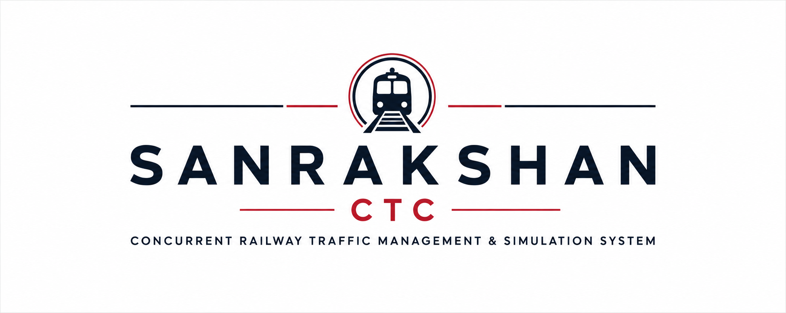
</p>

<h1 align="center">
🚆 SANRAKSHAN CTC
</h1>

<p align="center">
<b>Concurrent Railway Traffic Management & Simulation System</b>
<br>
A multithreaded railway traffic control simulator built with modern C++,
real-time WebSockets and an interactive control panel.
</p>

<p align="center">


</p>

---

# 🚀 Overview

Sanrakshan CTC is a real-time railway traffic control simulator inspired by modern Centralized Traffic Control (CTC) systems.

The simulator models an operational railway network where multiple trains execute concurrently while competing for shared railway infrastructure.

Instead of being a simple animation, every train runs as an independent thread. Shared railway tracks are synchronized using mutexes to prevent collisions while maintaining maximum throughput.

The project demonstrates practical Operating System concepts including:

- Multithreading
- Thread Synchronization
- Resource Allocation
- Deadlock Avoidance
- Graph Algorithms
- Event Driven Simulation
- Real-Time WebSocket Communication

---

# 📑 Table of Contents

- [🚀 Overview](#-overview)
- [🎥 Live Demonstration](#-live-demonstration)
- [✨ Features](#-features)
- [🏗 High-Level Architecture](#-high-level-architecture)
- [🚄 Train Dispatch Workflow](#-train-dispatch-workflow)
- [🔒 Concurrency & Safety](#-concurrency--safety)
- [🔄 Dynamic Route Recalculation](#-dynamic-route-recalculation)
- [📷 Screenshots](#-screenshots)
- [⚙ Technology Stack](#-technology-stack)
- [📂 Project Structure](#-project-structure)
- [🚀 Getting Started](#-getting-started)
- [🧪 Operating System Concepts Demonstrated](#-operating-system-concepts-demonstrated)
- [🎯 Future Improvements](#-future-improvements)
- [👨‍💻 Team](#-team)
- [📄 License](#-license)


# 🎥 Live Demonstration

<p align="center">

</p>

---

# ✨ Features

## 🚉 Railway Network

- Automatic railway yard generation
- Add new stations
- Delete stations
- Lay new railway tracks
- Single-track support
- Double-track support
- Bidirectional routing


## 🚄 Intelligent Train Dispatch

- Express trains
- Local trains
- Freight trains

Each category has

- Independent speed
- Priority level
- Scheduling behavior

Dispatch priority

```
Express
   ↓
Local
   ↓
Freight
```


## 🧠 Graph Routing

Shortest path calculation using

- Dijkstra Algorithm

Automatically computes

- Source → Destination route
- Updated route after failures


## ⚡ Concurrent Simulation

Each train runs independently using

- std::thread

Track segments become shared resources protected through

- std::mutex
- std::unique_lock
- try_lock()

allowing collision-free concurrent execution.


## 🛡 Kavach Style Collision Prevention

When two trains request the same track

- First train acquires lock
- Second train waits
- Track released
- Waiting train continues

No two trains occupy the same track simultaneously.


## 🚧 Dynamic Track Failure

Track failures can be simulated during execution.

The simulator

- Removes failed edge
- Recalculates shortest path
- Switches to alternate route
- Updates live telemetry

If no alternate path exists

- Journey stops safely
- Event is logged


## 🐘 Wildlife Temporary Speed Restriction

Wildlife crossings can be simulated.

When activated

- Train pauses
- Journey resumes after clearance
- Dashboard updates instantly


## 🚨 Emergency Stop

Global Emergency Stop immediately

- Pauses all train threads
- Preserves simulation state
- Prevents inconsistent execution

Simulation can later resume safely.


## 📡 Live Telemetry

Real-time dashboard displays

- Running trains
- Pending departures
- Event logs
- Active tracks
- Locked resources
- Simulation clock
- Train status

Updates are streamed through WebSockets.

---

# 🏗 High-Level Architecture

<p align="center">
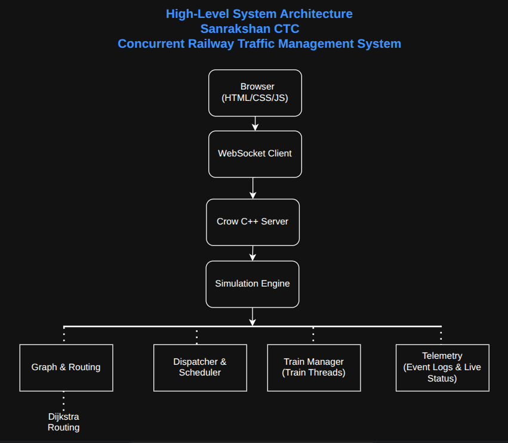
</p>

The browser communicates with the backend using persistent WebSocket connections.

The Crow C++ server manages the simulation engine which internally coordinates routing, scheduling, multithreaded train execution and telemetry updates before broadcasting the current system state back to the dashboard.


# 🚄 Train Dispatch Workflow

<p align="center">
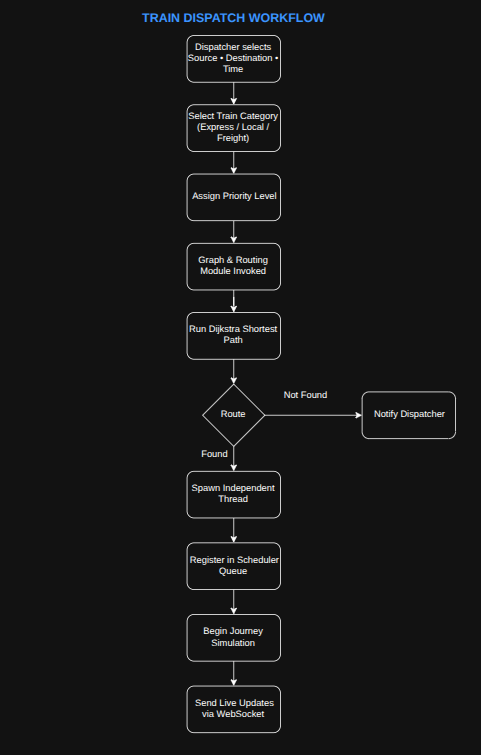
</p>

Train creation follows the complete dispatch pipeline

1. Dispatcher selects source and destination
2. Train category selected
3. Priority assigned
4. Dijkstra computes shortest path
5. Independent thread created
6. Scheduler registers train
7. Simulation begins
8. Live telemetry continuously updates dashboard


# 🔒 Concurrency & Safety

<p align="center">
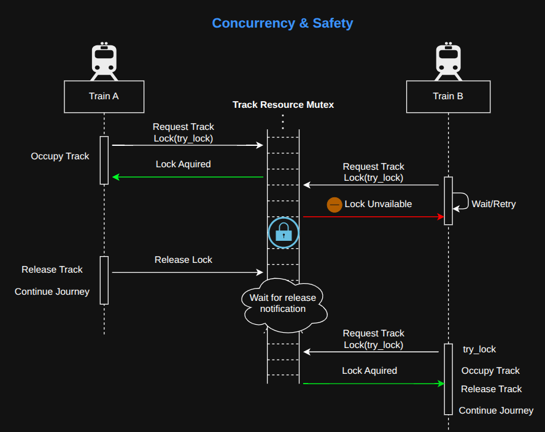
</p>

Each railway track behaves like a shared operating system resource.

Before entering a track, trains attempt to acquire ownership using non-blocking mutex locking.

If the resource is unavailable

- Train waits
- Collision avoided
- Lock retried
- Journey continues once released


# 🔄 Dynamic Route Recalculation

<p align="center">
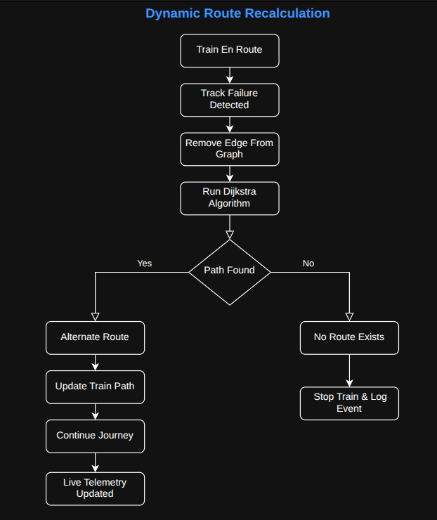
</p>

Whenever a track failure occurs

- Failed edge removed
- Graph updated
- Dijkstra executed again
- Alternate path selected
- Live telemetry refreshed

If no route exists the train safely terminates its journey.

---

# 📷 Screenshots

## Dashboard

<p align="center">
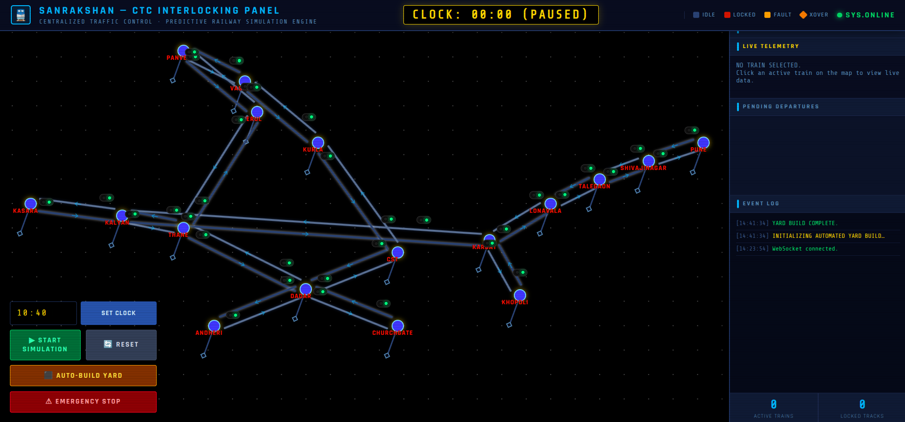
</p>


## Dispatch Panel

<p align="center">
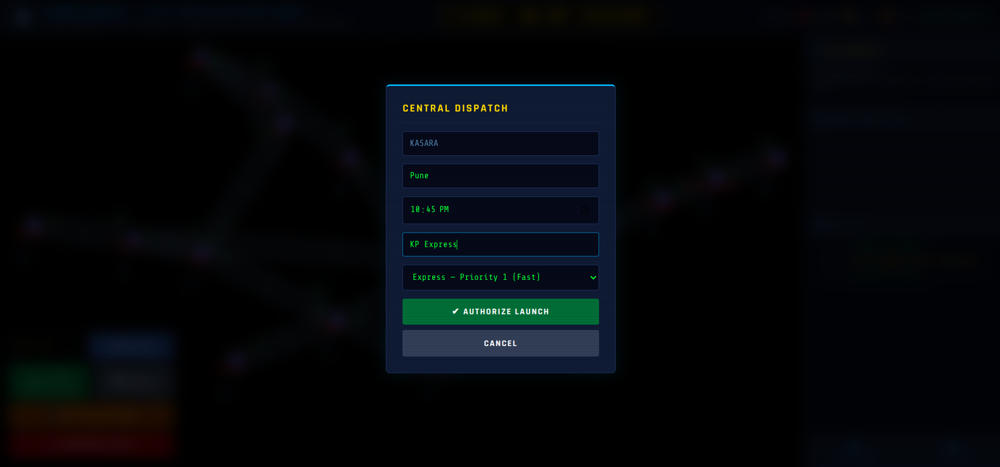
</p>


## Wildlife Event

<p align="center">
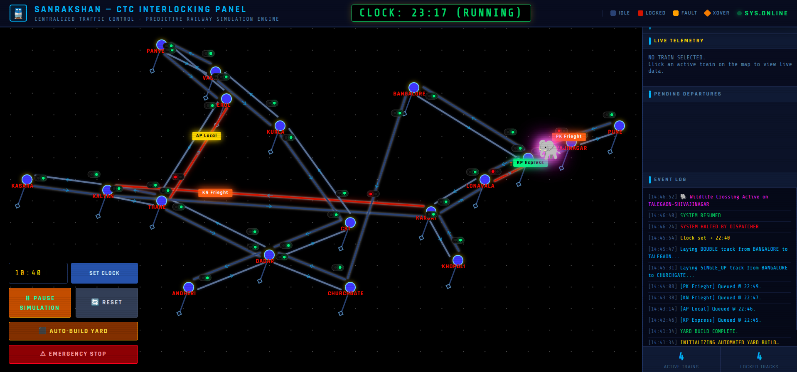
</p>


## Engineering Mode

<p align="center">
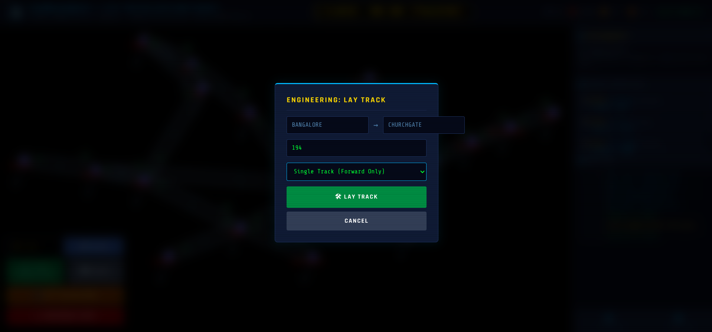
</p>


## Emergency Stop

<p align="center">
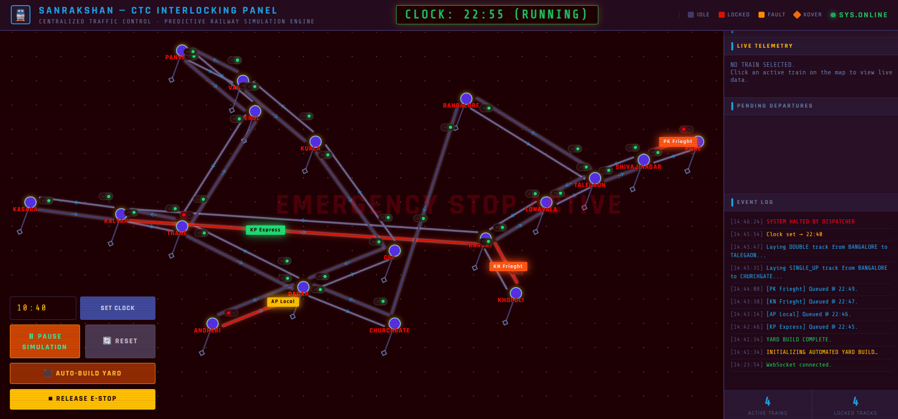
</p>


## Live Railway Simulation

<p align="center">

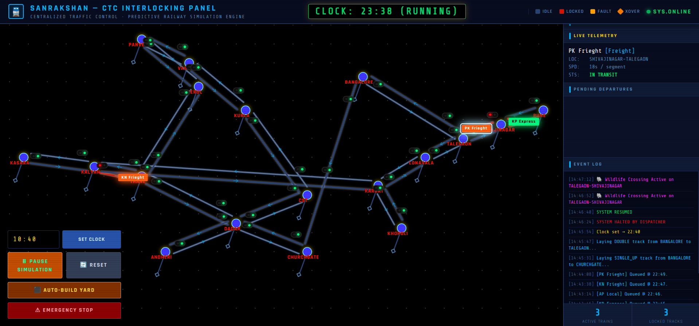
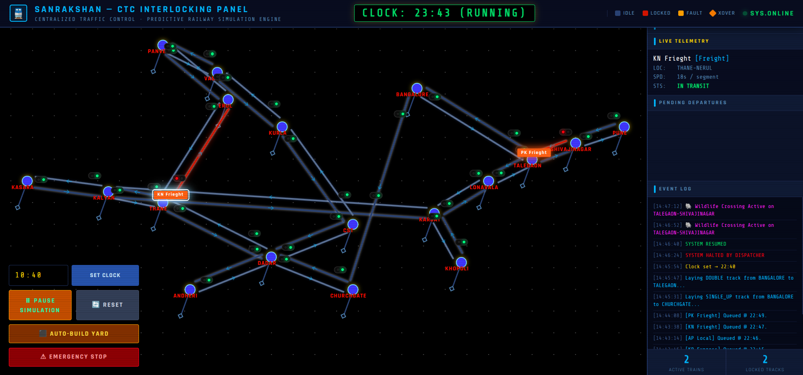

</p>

---

# ⚙ Technology Stack

## Backend

- C++17
- Crow Framework
- WebSockets
- nlohmann/json


## Frontend

- HTML5
- CSS3
- Vanilla JavaScript


## Concurrency

- std::thread
- std::mutex
- std::unique_lock
- std::atomic


## Algorithms

- Dijkstra Shortest Path
- Priority Scheduling
- Graph Traversal

---

# 📂 Project Structure

```
SANRAKSHAN/

│

├── backend/

├── frontend/

├── docs/

│ ├── banner.png

│ ├── demo.gif

│ ├── architecture/

│ └── screenshots/

│

├── README.md

└── LICENSE
```

---

# 🚀 Getting Started

## Clone Repository

```bash
git clone https://github.com/yourusername/SANRAKSHAN.git

cd SANRAKSHAN
```


## Build Backend

```bash
cd backend

mkdir build

cd build

cmake ..

make
```


## Start Server

```bash
./sanrakshan_server
```


## Launch Frontend

Simply open

```
frontend/index.html
```

The browser automatically connects to

```
localhost:8080
```

through WebSockets.


# 🧪 Operating System Concepts Demonstrated

- Thread Creation
- Synchronization
- Resource Sharing
- Non-blocking Mutex Locking
- Deadlock Avoidance
- Shared Resource Scheduling
- Atomic Operations
- Event Driven Systems


# 🎯 Future Improvements

- Automatic track repair
- Distributed railway simulation
- Passenger scheduling
- Timetable optimization
- AI dispatch assistant
- Persistent save/load
- Railway analytics dashboard

---

# 👨‍💻 Team

**Lavya Jain**

**Aaryamaan Rai**

---

# 📄 License

This project is licensed under the MIT License.

---

<p align="center">

⭐ If you found this project interesting, consider giving it a star.

</p>
